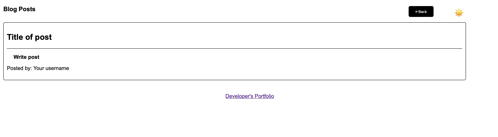

# <My-Blog-Posts>

## Description

My motivation to build this project was to allow someone to make a blog post and be able to submit. It would the lead to a next page where they could see more posts.
I built this to help create a place to make blog posts.
This problem solved an issue where someone may have that they couldn’t write a blog post and have it saved while being able to go back to the first page.
I learned how to create a toggle dark mode and light mode button.

## Table of Contents 

If your README is long, add a table of contents to make it easy for users to find what they need.

- [Installation](#installation)
- [Usage](#usage)
- [Credits](#credits)
- [License](#license)

## Installation

No need to install. The page is accessible to use on any browser.

## Usage

On the first page you are given a form to enter your user, title and content to make a blog post. You then have a submit button to submit. Once submitted, you will be directed to the second page where you can now see more posts. On both pages, there is a button on the top right (emojis). You may hit the buttons to toggle light mode and dark mode. On the second page, you are given a back page on top right to go back to the first page to make another post.

    
  
    
    

    
    
    

## Credits

N/A

## License

MIT License

Copyright (c) 2024 dannymcq2

Permission is hereby granted, free of charge, to any person obtaining a copy
of this software and associated documentation files (the "Software"), to deal
in the Software without restriction, including without limitation the rights
to use, copy, modify, merge, publish, distribute, sublicense, and/or sell
copies of the Software, and to permit persons to whom the Software is
furnished to do so, subject to the following conditions:

The above copyright notice and this permission notice shall be included in all
copies or substantial portions of the Software.

THE SOFTWARE IS PROVIDED "AS IS", WITHOUT WARRANTY OF ANY KIND, EXPRESS OR
IMPLIED, INCLUDING BUT NOT LIMITED TO THE WARRANTIES OF MERCHANTABILITY,
FITNESS FOR A PARTICULAR PURPOSE AND NONINFRINGEMENT. IN NO EVENT SHALL THE
AUTHORS OR COPYRIGHT HOLDERS BE LIABLE FOR ANY CLAIM, DAMAGES OR OTHER
LIABILITY, WHETHER IN AN ACTION OF CONTRACT, TORT OR OTHERWISE, ARISING FROM,
OUT OF OR IN CONNECTION WITH THE SOFTWARE OR THE USE OR OTHER DEALINGS IN THE
SOFTWARE.

---

🏆 The previous sections are the bare minimum, and your project will ultimately determine the content of this document. You might also want to consider adding the following sections.

## Badges

https://github.com/dannymcq2/module4blogging/actions/workflows/WORKFLOW-FILE/badge.svg

## Features

Able to post blog content and see other written content with user, title and content.
Light mode and dark mode buttons (emoji) to switch. Back button on blog section page to go back to the form.

## How to Contribute

[![Contributor Covenant](https://img.shields.io/badge/Contributor%
## Tests

Many tests were done to assure the application is good to go
